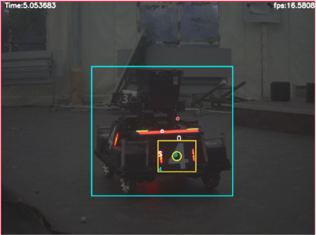
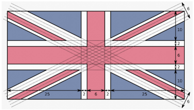
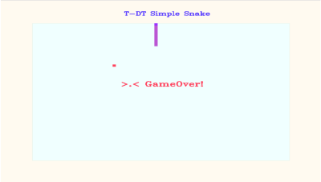
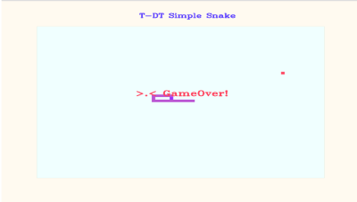

# T-DT 2027 青训计划 学习任务(3) OpenCV基础题

> + 积分榜不是录用与否唯一的决定因素，只能说是一个比较重要的参考依据，最终录用与否还要参考你在整个考核期间的综合表现与发展潜力。
> + 实验室不愿意淘汰热爱 RM 且勤恳努力的新手，也不会留下不利于团队发展的所谓强者。
> + 每题给出关键词。可根据关键词检索相关知识并完成习题。
> + 完成后将代码和运行结果（以视频或图片形式展现）发送至飞书审批。1、3 题提交视频，2 题提交截图，3（3）提交关键帧截图；选做贪吃蛇提交视频。

## !雷区!

> + 发现任何一条，立即取消入队资格并记入 T-DT 黑名单。
> + 考核过程中为了得高分，通过任何途径找他人替做任务后提交。
> + 照抄网上查到的程序，或者与他人提交的程序或文档雷同。

## 题号：1

> **关键词：** OpenCV、视频读取、摄像头调用、文字渲染
>
> **题目描述：** 使用 CMake 构建 C++/OpenCV 工程，编写程序，完成以下任务：
>
> 1. 读取并播放一个 ***.mp4*** 视频文件。
> 2. 计算视频文件帧率，并将结果文字实时渲染在画面右上角。要求渲染文字为白色。
> 3. 调用笔记本前置摄像头或免驱相机，重复步骤 2。（若电脑设备故障可跳过此问）

> <strong>注意！右上角的帧率指的是实时帧率，不是定值。</strong>

### ***运行效果截图：***

## 题号：2

> **关键词：** OpenCV、拷贝图像、图像显示
>
> **题目描述：** 使用 CMake 构建 C++/OpenCV 工程，编写程序，完成以下任务：
>
> 1. 利用 **OpenCV** 中的 **copyTo()** 方法，绘制一面俄罗斯国旗并打印在窗口上，规格如下：
>    - 长宽比：**3：2**，建议以 **900 × 600** 的分辨率绘制。
>    - RGB 标准色：白 **（255, 255, 255）**，蓝 **（0, 81, 186）**，红 **（216, 30, 5）**。
> 2. 使用 **OpenCV** 绘制一面英国国旗并打印在窗口上，规格如下：
>    - 长宽比：**2：1**，建议以 **1000 × 500** 的分辨率绘制。
>    - RGB 标准色：白 **（255, 255, 255）**，蓝 **（1, 33, 105）**，红 **（200, 16, 46）**。

### ***具体比例和效果图如下：***

  

## 题号：3 飞翔的橘子

> **关键词：** 略（避免限制思路~）
>
> **题目描述：** 橘子是一种很好吃的水果，但你能准确识别并跟踪它的行动吗？现在请你使用 CMake 构建 C++/OpenCV 工程，题目要求如下：
>
> 1. 识别视频中的橘子，并绘制它的最小外接圆。尽可能保证不误识别、不掉识别。
> 2. 绘制出橘子当前中心点和 0.5 s 内橘子历史中心点。（实心圆圈表示，用不同颜色作出区分）
> 3. （选做）视频最后有一段时间橘子被遮挡的画面（即使时间很短，但相信你仍然丧失了识别橘子的能力），你能想办法即使没有识别到橘子，却仍然继续跟踪它吗？尝试预测它的轨迹吧！

## 选做：贪吃蛇小游戏

> **关键词：** OpenCV、面向对象、贪吃蛇
>
> **题目描述：** 贪吃蛇最初为人们所知的是诺基亚手机附带的一个小游戏，它伴随着诺基亚手机走向世界。现在请你使用 CMake 构建 C++/OpenCV 工程，以面向对象的思想编写贪吃蛇游戏，规则如下：
>
> 1. 使用 OpenCV 绘制地图、蛇身、食物，以及蛇运动时的动态变化。
> 2. 使用键盘 W、A、S、D 控制蛇的移动。
> 3. 随机生成食物坐标，开局时初始化一个，之后每次被蛇吃掉后都新生成一个，并且新生成的食物不可与蛇的任意部位重合。
> 4. 初始化时蛇的长度不小于 2（至少有蛇头 + 一节蛇身），每吃掉一个食物，蛇身长度 +1。
> 5. 游戏开始后，蛇不可反向运动（例如蛇向左运动时，D 键应该失去控制效果）。
> 6. 有明确的游戏结束判定：① 蛇头碰撞蛇身；② 蛇碰撞地图边界。
> 7. 务必使用面向对象思想！

### ***运行效果截图：***

 

