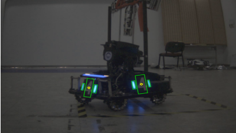
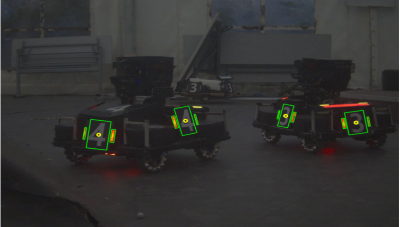
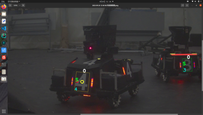
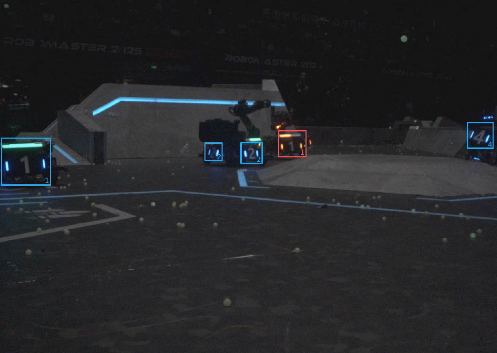
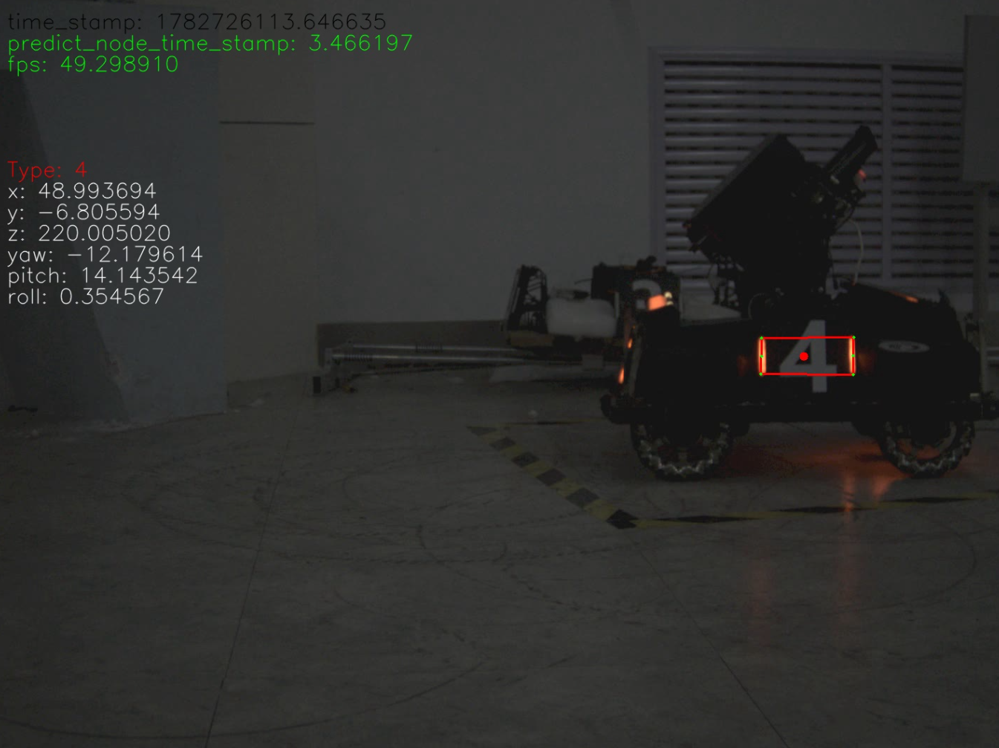

# T-DT 2027 青训计划 学习任务(5)<br>OpenCV进阶题

> + 实验室不愿意淘汰热爱RM且勤恳努力的新手，也不会留下不利于团队发展的所谓强者。
> + 每题给出关键词。可根据关键词检索相关知识并完成习题。
> + 完成后将代码和运行结果(以视频或图片形式展现)提交至飞书，每个任务单独提交。
> + 进阶部分用到的大部分知识与视觉工程和校园赛相关，没有必须达到的指标，大家根据自己的能力做下去即可。
> + 由于进阶部分的题目之间有一定联系，随便选做可能会导致事倍功半。出题顺序即为选题建议。

## !雷区!

> + 严禁找他人代做、直接复制他人代码或提交与他人高度雷同的结果。
> + 允许查阅资料、参考开源实现和使用 AI 辅助学习，但必须理解代码内容，并在 README 中注明参考来源和自己完成的部分。
> + 若发现代做或恶意抄袭，立即取消入队资格。
> + 数据集和视频严禁外传，违者立即取消入队资格。

## 本进阶题建议使用同一个 CMake 工程逐步迭代完成。任务 2、3、4 均可在任务 1 的代码基础上继续扩展。

## 题号：1

> **关键词：** 通道分离、二值化、阈值化、轮廓检测、旋转矩形
>
> **题目描述：** 使用 CMake 构建 C++/OpenCV 工程，编写程序，完成以下任务：
>
> 1. 读取附件中的视频，识别步兵车上的灯条。（可以使用 trackbar 调参）
> 2. 绘制每个识别出的装甲板轮廓（一种颜色即可），并用圆点或圆圈标出装甲板中心。（灯条与数字区域分别框出）
> 3. 程序应能切换识别目标颜色（红色 / 蓝色）。最低要求：通过修改程序中的明确参数并重新编译完成切换。加分项：通过配置文件、命令行参数或 trackbar 完成切换，做到不重新编译即可切换颜色。
> 4. 画面右上角输出运行帧率。（可参考基础题第 1 题第 2 小问）
> 5. 保证识别准确性、稳定性。能做到不掉识别、不误识别。


## 题号：2

> **关键词：** 机器学习、数字识别、C++ 类
>
> **题目描述：** 使用 CMake 构建 C++/OpenCV 工程，编写程序，完成以下任务：
>
> 1. 简单了解支持向量机 **(SVM)** 或卷积神经网络 **（CNN）** 等机器学习原理。使用 **C++** 或 **python** 编写程序，训练一个识别装甲板贴纸数字的模型。（文件包里提供了数据集，各 100 张，不够可以找学长要或者自己查找）（数字识别方式不做统一标准，不使用机器学习也可以）
> 2. 在第一题程序基础上调用训练模型实现数字识别。（要求调用程序为 **C++**）
> 3. 构建装甲板 **Armor** 基类。要求将识别出的数字标识在装甲板左下角区域，并将同一数字、同一颜色装甲板归于一类。（类中内容自行决定）
> 4. 在 infantry_red 视频中，完整的装甲板应能识别。要求误检、漏检较少，并能说明造成误检/漏检的原因。
> 5. 在给定的 2025sj.mp4 视频中，大部分正常可见的亮装甲板应能识别。允许短暂丢失，但要求误检较少，并能说明造成误检/漏检的原因。


## 题号：3

> **关键词：** OpenCV 单目相机标定、张正友标定法、solvePnP
>
> **题目描述：** 使用 CMake 构建 C++/OpenCV 工程，编写程序，完成以下任务：
>
> 1. 学习张正友标定法，学习齐次坐标变换（及其逆变换），**cv::solvePnP** 的基本原理与基础操作。
> 2. 在完成一二问的基础上，定义相机系下 x 向右为正、y 向下为正、z 向前为正，对 Infantry_red1.mp4 和 Infantry_red2.mp4 视频中的装甲板做 **SolvePnP** 解算（解算点集为左灯条上下、右灯条上下共四点），并比较不同 **PnP** 参数差异。（着重对比 ITERATIVE、EPNP、IPPE 之间的差异）将得到的旋转向量 **rvec** 和平移向量 **tvec**，以及装甲板相对相机的距离等信息分别储存在同一装甲板（即数字相同）对应的类中。
> 3. 了解旋转向量和平移向量的物理和数学性质。具体可参考《视觉SLAM十四讲》。
> 4. 在 infantry_red2 视频中，完整输出装甲板 x、y、z、yaw、pitch、roll（单位：mm、deg）。

- 这里附上相机参数：

```json
matrix: !!opencv-matrix
   rows: 3
   cols: 3
   dt: d
   data: [
        1.7774091341308808e+03, 0.0, 7.1075979428865026e+02,
        0.0, 1.7754170626354828e+03, 5.3472407285624729e+02,
        0.0, 0.0, 1.0
   ]
dist_coeffs: !!opencv-matrix
   rows: 1
   cols: 5
   dt: d
   data: [
        -5.6313426428564950e-01,
        1.8301501710641366e-01,
        1.9661478907901904e-03,
        9.6259122849674621e-04,
        5.6883803390679100e-01
   ]
```


## 题号：4

> **关键词：** 机动目标追踪、卡尔曼滤波、多项式回归
>
> **题目描述：** 使用 CMake 构建 C++/OpenCV 工程，编写程序，完成以下任务。
>
> **前提：**
>
> 1. 弹丸发射速度约为 **25 m/s**。
> 2. 忽略弹丸发射机构原点与相机原点距离，默认二者重合。
> 3. 我方整体处于静止状态。
> 4. 发射机构耗时可忽略不计，只考虑弹丸飞行时间。
>
> **任务：**
>
> 1. 设计你认为最合理的评分系统，选择画面中待击打的一块装甲板，用更显目的颜色标出。（尽可能保证待击打目标不频繁切换）
> 2. 根据常识，子弹从发射到命中装甲板需要一定时间，且这段时间内装甲板也在运动。预测相机坐标系下装甲板最有可能到达的位置，使得当前时刻弹丸发射能以最大概率命中。并将该点重投影到图像坐标系下，用颜色区别于装甲板中心的圆圈做出标识。
> 3. 最低要求：假设装甲板在短时间内匀速运动，根据最近若干帧的 PnP 三维位置估计速度，计算弹丸飞行时间 `t = distance / bullet_speed`，预测位置 `p_pred = p_now + v * t`，再将预测点重投影到图像中。加分项：使用卡尔曼滤波、多项式回归或更合理的目标切换策略。











